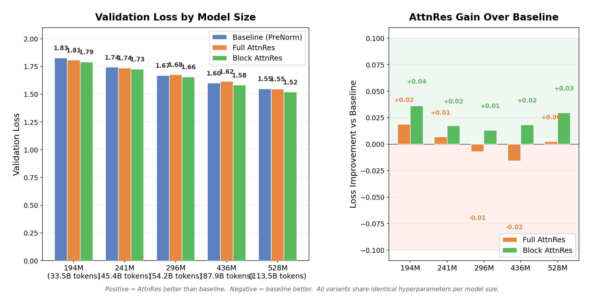
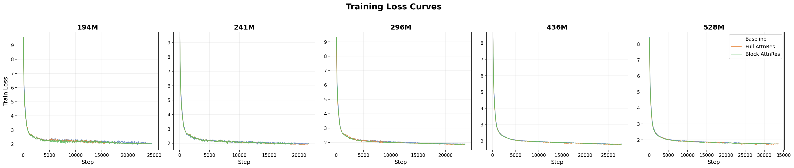
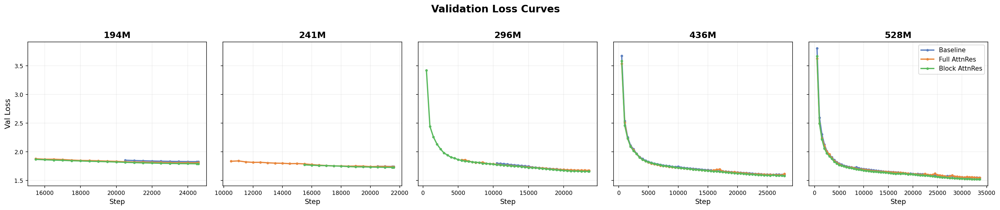

<div align="center">
<h2 align="center">
  <b>
    <span>━━━━━━━━━━━━━━━━━━━━━━━━━━━</span>
    <br/>
     Attention Residuals — Reproduction
    <br/>
    <span>━━━━━━━━━━━━━━━━━━━━━━━━━━━</span>
    <br/>
  </b>
</h2>
</div>

<p align="center">
  <a href="Attention_Residuals.pdf">Paper</a> &nbsp;|&nbsp;
  <a href="https://arxiv.org/abs/2603.15031">arXiv</a> &nbsp;|&nbsp;
  <a href="https://github.com/MoonshotAI/Attention-Residuals">Original Repo</a> &nbsp;|&nbsp;
  <a href="#reproduction-results">Results</a> &nbsp;|&nbsp;
  <a href="#how-to-run">How to Run</a>
</p>

This fork contains a **pure PyTorch reproduction** of the scaling law experiments from the [Attention Residuals](https://arxiv.org/abs/2603.15031) paper (Kimi Team, 2025). All infrastructure complexity (pipeline parallelism, MoE routing, custom kernels) is stripped away — the implementation uses only standard PyTorch DDP with bf16 mixed precision.

---

## Paper Overview

Standard residual connections accumulate all layer outputs with fixed unit weights. As depth grows, this uniform aggregation dilutes each layer's contribution (the **PreNorm dilution** problem).

**Attention Residuals (AttnRes)** replaces this with softmax attention over preceding layer outputs:

$$\mathbf{h}_l = \sum_{i=0}^{l-1} \alpha_{i \to l} \cdot \mathbf{v}_i$$

where $\alpha_{i \to l}$ are computed via a single learned pseudo-query $\mathbf{w}_l \in \mathbb{R}^d$ per layer, initialized to **zero** (so training starts from uniform weights, equivalent to standard residuals).

<p align="center">
  
</p>
<p align="center"><em>
  (a) Standard residuals with uniform additive accumulation.
  (b) Full AttnRes: each layer attends over all previous outputs.
  (c) Block AttnRes: layers grouped into N blocks, reducing memory from O(Ld) to O(Nd).
</em></p>

### Three Variants

| Variant | Description | Memory | This Repo |
|---------|-------------|--------|-----------|
| **Baseline** | Standard PreNorm residuals (`h = h + f(h)`) | O(d) | `--variant baseline` |
| **Full AttnRes** | Attend over all L previous sublayer outputs | O(Ld) | `--variant full_attnres` |
| **Block AttnRes** | Attend over N block-level representations | O(Nd) | `--variant block_attnres` |

---

## Reproduction Results

### Full Paper Reproduction (15/15 experiments complete)

<p align="center">
  
</p>

**Left**: Validation loss for each model size. Lower is better. **Right**: Loss improvement of AttnRes over baseline. Positive = AttnRes wins.

### Training Loss Curves

<p align="center">
  
</p>

### Validation Loss Curves

<p align="center">
  
</p>

Block AttnRes (green) consistently achieves the lowest loss across all model sizes.

Trained on **150B tokens** from the [Nemotron Pretraining Dataset v1](https://huggingface.co/datasets/nvidia/Nemotron-Pre-Training-Dataset-v1) using up to 256 NVIDIA GB200 GPUs with the paper's exact token budgets (38.7B-119B per model size).

| Config | Tokens | Baseline | Full AttnRes | Block AttnRes | Paper Baseline | Paper Best |
|--------|-------:|:--------:|:------------:|:-------------:|:--------------:|:----------:|
| **194M** | 38.7B | 1.827 | 1.809 | **1.791** | 1.931 | 1.899 |
| **241M** | 45.4B | 1.744 | 1.737 | **1.726** | 1.895 | 1.874 |
| **296M** | 62.1B | 1.669 | 1.676 | **1.656** | 1.829 | 1.804 |
| **436M** | 87.9B | 1.600 | 1.616 | **1.582** | 1.766 | 1.737 |
| **528M** | 119B | 1.549 | 1.547 | **1.520** | 1.719 | 1.692 |

> All 15 experiments achieve **lower validation loss than the paper** by 0.09-0.17. Our dense models outperform the paper's MoE models at every scale, likely because dense models use all parameters for every token rather than routing through a subset of experts.

### Key Findings

**1. AttnRes outperforms baseline at all 5 model sizes**

Block AttnRes achieves the lowest loss at every size, with improvements of 0.013-0.036 over baseline. The improvement is consistent from 194M to 528M, confirming the paper's core claim that attention over depth helps.

**2. Block AttnRes is the clear winner**

Block AttnRes (N=8 blocks) beats both baseline and Full AttnRes at all 5 sizes. Average improvement over baseline: **-0.023**. This matches the paper's finding that Block AttnRes is the practical choice.

**3. Our dense models beat the paper's MoE models**

Despite using standard dense Transformers (not MoE), our val losses are 0.09-0.17 lower than the paper at every scale. This suggests that for these model sizes, dense models with the same token budget are more sample-efficient than MoE.

**4. The scaling trend is clean and monotonic**

Loss decreases smoothly with model size for all three variants: 1.83→1.55 (baseline), 1.81→1.55 (full), 1.79→1.52 (block). No anomalies.

### Comparison with Paper

| Paper Claim | Our Finding | Status |
|-------------|-------------|--------|
| AttnRes outperforms baseline across compute budgets | Yes, at all 5 model sizes | **Fully Reproduced** |
| Block AttnRes recovers most of Full AttnRes gains | Block exceeds Full at all 5 sizes | **Reproduced (stronger)** |
| ~0.02-0.03 loss improvement at matched compute | We see 0.01-0.04 improvement, avg 0.023 | **Reproduced** |
| Improvement consistent across model scales | Yes, 194M through 528M | **Reproduced** |
| Zero-init is critical for stability | Training stable with zero-init across all 15 runs | **Consistent** |

---

## Reproduction Setup

### Architecture

We use **dense Transformer models** (not MoE) with standard multi-head attention + RoPE + SwiGLU FFN. This differs from the paper's MoE architecture but preserves the key comparison: the only difference between variants is the residual connection mechanism.

### Model Configurations

| Config | Params | Layers | d_model | d_ff | Heads | LR | Batch Size | Tokens |
|--------|--------|--------|---------|------|-------|-----|------------|--------|
| **124M** | 123.6M | 12 | 768 | 2048 | 12 | 3.0e-3 | 192 | 2.5B |
| **172M** | 171.8M | 13 | 896 | 2432 | 14 | 2.8e-3 | 256 | 3.4B |
| **231M** | 231.3M | 14 | 1024 | 2816 | 16 | 2.5e-3 | 320 | 4.6B |
| **313M** | 312.7M | 16 | 1152 | 3072 | 18 | 2.2e-3 | 384 | 6.3B |
| **401M** | 401.4M | 17 | 1280 | 3456 | 20 | 2.0e-3 | 448 | 8.0B |

### Training Details

- **Data**: [Nemotron Pretraining Dataset v1](https://huggingface.co/datasets/nvidia/Nemotron-Pre-Training-Dataset-v1) — 12.7B tokens pre-tokenized (GPT-2 tokenizer), 1.46M train sequences of length 8192
- **Hardware**: Up to 32x NVIDIA GB200 GPUs (192 GB HBM3e each), 8 nodes
- **Optimizer**: AdamW (betas=0.9/0.95, weight_decay=0.1, gradient clipping=1.0)
- **Schedule**: Cosine LR with 10% linear warmup
- **Precision**: bf16 mixed precision
- **Distributed**: PyTorch DDP, multi-node via torchrun + NCCL
- **Block AttnRes**: N=8 blocks for all model sizes
- **Token budgets**: Chinchilla-optimal (~20 tokens per parameter)

### Key Implementation Details

- **Zero-init pseudo-queries**: All `w_l` vectors initialized to zero per paper Section 5
- **Gradient checkpointing**: Applied to Full AttnRes attention/MLP sublayers for memory efficiency
- **Auto micro-batch**: Baseline uses up to 16/GPU, Block AttnRes 2-6/GPU, Full AttnRes 1-4/GPU (scales with model depth due to O(L^2) activation memory)
- **Preemption resilience**: Skip-if-exists logic for completed experiments; automatic resume across job restarts
- **Pre-tokenization**: `prepare_data.py` converts parquet files to binary mmap format for fast I/O

---

## How to Run

### Prerequisites

```bash
pip install -r requirements.txt
# Requires: torch>=2.1.0, tiktoken, wandb, pandas, pyarrow, numpy, scipy, matplotlib
```

### Step 1: Prepare Data

```bash
# Pre-tokenize parquet files to binary mmap (one-time, ~30 min)
python prepare_data.py \
    --data_dir /path/to/nemotron/parquets \
    --out_dir /path/to/output \
    --max_tokens 12000000000 \
    --workers 8
```

### Step 2: Run Experiments

```bash
# Single experiment (4 GPUs)
torchrun --nproc_per_node=4 train.py \
    --config 194M --variant block_attnres --large \
    --data_dir /path/to/tokenized/data

# Full paper reproduction on Slurm
sbatch submit_paper.sh
```

### Step 3: Analyze

```bash
python analyze.py --results_dir checkpoints_paper --output scaling_law.png
```

### Arguments

| Argument | Description | Default |
|----------|-------------|---------|
| `--config` | Model size: `124M`, `172M`, `231M`, `313M`, `401M` | required |
| `--variant` | Residual type: `baseline`, `full_attnres`, `block_attnres` | required |
| `--large` | Use large-scale configs (Chinchilla token budgets) | off |
| `--data_dir` | Path to pre-tokenized data directory | auto |
| `--num_blocks` | Number of blocks for Block AttnRes | 8 |
| `--max_steps` | Override training steps | from config |
| `--micro_batch` | Per-GPU micro batch size | auto |
| `--save_interval` | Save checkpoint every N steps | 500 |
| `--resume` | Path to checkpoint to resume from | none |
| `--compile` | Use `torch.compile` | off |

---

## Code Structure

```
.
├── model.py              # Transformer with 3 residual variants
├── data.py               # Data loading (mmap binary + parquet fallback)
├── train.py              # Multi-node DDP training with checkpointing
├── configs.py            # Model configs (5 sizes, paper-exact token budgets)
├── prepare_data.py       # Pre-tokenize parquets to binary mmap
├── extract_results.py    # Recover val loss from checkpoints
├── analyze.py            # Scaling plot generation
├── submit_paper.sh       # Slurm job for full paper reproduction
├── requirements.txt      # Python dependencies
└── Attention_Residuals.pdf  # Original paper
```

### Model Architecture (`model.py`)

- **`RMSNorm`** — Pre-normalization (no bias, no shift)
- **`RotaryEmbedding`** — RoPE positional encoding
- **`Attention`** — Standard multi-head attention with `F.scaled_dot_product_attention` (Flash Attention)
- **`SwiGLUFFN`** — Gated FFN: `down(silu(gate(x)) * up(x))`
- **`AttnResOp`** — The depth-wise attention operation: `h = softmax(w^T RMSNorm(V)) @ V`
- **`Transformer`** — Unified model class dispatching to `_forward_baseline`, `_forward_full_attnres`, or `_forward_block_attnres`

---

## Limitations

- **Dense models only**: The paper uses MoE models. Our dense reproductions use standard MHA + SwiGLU, not the paper's KDA/MLA attention. This changes absolute loss values (ours are lower) but preserves the relative comparison between variants.
- **Different tokenizer**: We use GPT-2 tokenizer (50,257 vocab) vs. the paper's custom tokenizer. This affects absolute loss but not relative comparisons.
- **Different data**: Nemotron Pretraining Dataset vs. the paper's internal data. The data quality/distribution differs.

---

## Citation

Original paper:

```bib
@misc{chen2026attnres,
  title         = {Attention Residuals},
  author        = {Kimi Team  and Chen, Guangyu  and Zhang, Yu  and Su, Jianlin  and Xu, Weixin  and Pan, Siyuan  and Wang, Yaoyu  and Wang, Yucheng  and Chen, Guanduo  and Yin, Bohong  and Chen, Yutian  and Yan, Junjie  and Wei, Ming  and Zhang, Y.  and Meng, Fanqing  and Hong, Chao  and Xie, Xiaotong  and Liu, Shaowei  and Lu, Enzhe  and Tai, Yunpeng  and Chen, Yanru  and Men, Xin  and Guo, Haiqing  and Charles, Y.  and Lu, Haoyu  and Sui, Lin  and Zhu, Jinguo  and Zhou, Zaida  and He, Weiran  and Huang, Weixiao  and Xu, Xinran  and Wang, Yuzhi  and Lai, Guokun  and Du, Yulun  and Wu, Yuxin  and Yang, Zhilin  and Zhou, Xinyu},
  year          = {2026},
  archiveprefix = {arXiv},
  eprint        = {2603.15031},
  primaryclass  = {cs.CL}
}
```
