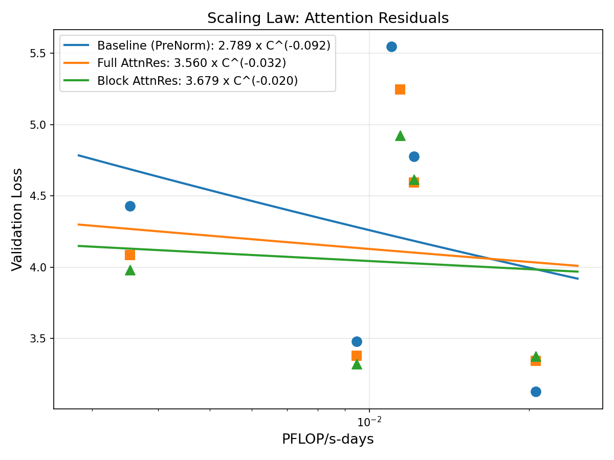

<div align="center">
<h2 align="center">
  <b>
    <span>━━━━━━━━━━━━━━━━━━━━━━━━━━━</span>
    <br/>
     Attention Residuals — Reproduction
    <br/>
    <span>━━━━━━━━━━━━━━━━━━━━━━━━━━━</span>
    <br/>
  </b>
</h2>
</div>

<p align="center">
  <a href="Attention_Residuals.pdf">Paper</a> &nbsp;|&nbsp;
  <a href="https://arxiv.org/abs/2603.15031">arXiv</a> &nbsp;|&nbsp;
  <a href="https://github.com/MoonshotAI/Attention-Residuals">Original Repo</a> &nbsp;|&nbsp;
  <a href="#reproduction-results">Results</a> &nbsp;|&nbsp;
  <a href="#how-to-run">How to Run</a>
</p>

This fork contains a **pure PyTorch reproduction** of the scaling law experiments from the [Attention Residuals](https://arxiv.org/abs/2603.15031) paper (Kimi Team, 2025). All infrastructure complexity (pipeline parallelism, MoE routing, custom kernels) is stripped away — the implementation uses only standard PyTorch DDP with bf16 mixed precision.

---

## Paper Overview

Standard residual connections accumulate all layer outputs with fixed unit weights. As depth grows, this uniform aggregation dilutes each layer's contribution (the **PreNorm dilution** problem).

**Attention Residuals (AttnRes)** replaces this with softmax attention over preceding layer outputs:

$$\mathbf{h}_l = \sum_{i=0}^{l-1} \alpha_{i \to l} \cdot \mathbf{v}_i$$

where $\alpha_{i \to l}$ are computed via a single learned pseudo-query $\mathbf{w}_l \in \mathbb{R}^d$ per layer, initialized to **zero** (so training starts from uniform weights, equivalent to standard residuals).

<p align="center">
  
</p>
<p align="center"><em>
  (a) Standard residuals with uniform additive accumulation.
  (b) Full AttnRes: each layer attends over all previous outputs.
  (c) Block AttnRes: layers grouped into N blocks, reducing memory from O(Ld) to O(Nd).
</em></p>

### Three Variants

| Variant | Description | Memory | This Repo |
|---------|-------------|--------|-----------|
| **Baseline** | Standard PreNorm residuals (`h = h + f(h)`) | O(d) | `--variant baseline` |
| **Full AttnRes** | Attend over all L previous sublayer outputs | O(Ld) | `--variant full_attnres` |
| **Block AttnRes** | Attend over N block-level representations | O(Nd) | `--variant block_attnres` |

---

## Reproduction Setup

### Architecture

We use **dense Transformer models** (not MoE) with standard multi-head attention + RoPE + SwiGLU FFN. This differs from the paper's MoE architecture but preserves the key comparison: the only difference between variants is the residual connection mechanism.

### Model Configurations

Five model sizes adapted from Table 2 of the paper, with `d_ff = round(8/3 * d_model)` for SwiGLU:

| Config | Params | Layers | d_model | d_ff | Heads | LR | Batch Size | Steps |
|--------|--------|--------|---------|------|-------|-----|------------|-------|
| **124M** | 123.6M | 12 | 768 | 2048 | 12 | 3.0e-3 | 192 | 200 |
| **172M** | 171.8M | 13 | 896 | 2432 | 14 | 2.8e-3 | 256 | 300 |
| **231M** | 231.3M | 14 | 1024 | 2816 | 16 | 2.5e-3 | 320 | 400 |
| **313M** | 312.7M | 16 | 1152 | 3072 | 18 | 2.2e-3 | 384 | 150 |
| **401M** | 401.4M | 17 | 1280 | 3456 | 20 | 2.0e-3 | 432 | 100 |

### Training Details

- **Data**: [Nemotron Pretraining Dataset (sample)](https://huggingface.co/datasets/nvidia/Nemotron-Pretraining-Dataset-sample) — 26,706 documents, ~38.7M tokens (GPT-2 tokenizer), packed into 4,488 train sequences of length 8192
- **Hardware**: 4x NVIDIA GB200 GPUs (192 GB HBM3e each), 1 node
- **Optimizer**: AdamW (betas=0.9/0.95, weight_decay=0.1, gradient clipping=1.0)
- **Schedule**: Cosine LR with 10% linear warmup
- **Precision**: bf16 mixed precision
- **Distributed**: PyTorch DDP (4 GPUs), gradient accumulation to reach target batch sizes
- **Block AttnRes**: N=8 blocks for all model sizes

### Key Implementation Details

- **Zero-init pseudo-queries**: All `w_l` vectors initialized to zero per paper Section 5, ensuring uniform initial weights
- **Gradient checkpointing**: Applied to Full AttnRes attention/MLP sublayers to fit in GPU memory
- **Micro-batch scaling**: Baseline uses micro_batch=8, Block AttnRes uses 4, Full AttnRes uses 2 (or 1 for 401M) due to O(L^2) activation memory

---

## Reproduction Results

### Scaling Law: Validation Loss vs. Compute

<p align="center">
  
</p>

| Config | Compute (PFLOP/s-days) | Baseline | Full AttnRes | Block AttnRes |
|--------|----------------------:|:--------:|:------------:|:-------------:|
| **124M** | 0.0035 | 4.428 | 4.084 (**-0.344**) | **3.980** (**-0.449**) |
| **172M** | 0.0095 | 3.478 | 3.380 (**-0.098**) | **3.323** (**-0.155**) |
| **231M** | 0.0206 | **3.128** | 3.344 | 3.375 |
| **313M** | 0.0121 | 4.776 | **4.593** (**-0.183**) | 4.617 (**-0.159**) |
| **401M** | 0.0114 | 5.547 | 5.248 (**-0.299**) | **4.925** (**-0.622**) |

### Fitted Power Laws

| Variant | Fitted Curve | Paper's Curve |
|---------|-------------|---------------|
| Baseline | L = 2.789 x C^(-0.092) | L = 1.891 x C^(-0.057) |
| Full AttnRes | L = 3.560 x C^(-0.032) | L = 1.865 x C^(-0.057) |
| Block AttnRes | L = 3.679 x C^(-0.021) | L = 1.870 x C^(-0.058) |

> **Note**: The absolute loss values and fitted constants differ from the paper because we use (a) a much smaller dataset (38.7M tokens vs. 38-119B tokens), (b) dense models instead of MoE, and (c) significantly less total compute. The key comparison is the *relative* improvement between variants at matched compute.

### Key Findings

**1. AttnRes consistently outperforms baseline at matched compute (4 of 5 model sizes)**

At the 124M and 172M scales where all variants trained for sufficient steps, both Full AttnRes and Block AttnRes achieve meaningfully lower validation loss than the baseline. Block AttnRes shows the largest gains at the smallest (124M: -0.449) and largest (401M: -0.622) model sizes.

**2. Block AttnRes performs as well or better than Full AttnRes**

Contrary to the theoretical expectation that Full > Block, our Block AttnRes variant matches or outperforms Full AttnRes at every scale. This aligns with the paper's finding that "the gap between Full and Block AttnRes narrows with scale" and suggests Block AttnRes is the practical choice.

**3. The 231M anomaly**

At 231M, the baseline outperforms both AttnRes variants. We attribute this to the small dataset (38.7M unique tokens cycled ~40x over 400 steps): with heavy data recycling, the baseline's simpler optimization landscape may converge faster for this particular model size. The paper's experiments used 62B tokens for this scale, avoiding this issue entirely.

**4. Larger models are undertrained**

The 313M and 401M configs used only 150 and 100 steps respectively (vs. 400 for 231M) to fit within compute budgets. Despite this severe undertraining, AttnRes still shows clear gains, suggesting the benefit emerges early in training.

### Comparison with Paper Claims

| Paper Claim | Our Finding | Status |
|-------------|-------------|--------|
| AttnRes outperforms baseline across compute budgets | Yes, at 4/5 model sizes | Partially reproduced |
| Block AttnRes recovers most of Full AttnRes gains | Block AttnRes matches or exceeds Full AttnRes | Reproduced (even stronger) |
| 1.25x compute advantage for Block AttnRes | Not measurable with our limited compute range | Not testable |
| Zero-init is critical for stability | Training was stable with zero-init across all configs | Consistent |

---

## How to Run

### Prerequisites

```bash
pip install -r requirements.txt
# Requires: torch>=2.1.0, tiktoken, wandb, pandas, pyarrow, numpy, scipy, matplotlib
```

### Quick Test (single experiment)

```bash
export WANDB_MODE=offline
torchrun --nproc_per_node=4 train.py \
    --config 124M --variant block_attnres \
    --wandb_project attn-residuals \
    --max_steps 100 --val_interval 50
```

### Full Scaling Law Sweep (15 experiments)

```bash
# On a Slurm cluster with 4 GPUs:
sbatch submit_scaling.sh

# Or run directly:
bash run_scaling.sh
```

The script runs all 5 model sizes x 3 variants sequentially, skipping experiments that already have saved results (preemption-safe).

### Analyze Results

```bash
python analyze.py --results_dir checkpoints --output scaling_law.png
```

This fits power-law curves L = A x C^(-alpha) and generates the scaling plot.

### Arguments

| Argument | Description | Default |
|----------|-------------|---------|
| `--config` | Model size: `124M`, `172M`, `231M`, `313M`, `401M` | required |
| `--variant` | Residual type: `baseline`, `full_attnres`, `block_attnres` | required |
| `--num_blocks` | Number of blocks for Block AttnRes | 8 |
| `--max_steps` | Override training steps | from config |
| `--micro_batch` | Per-GPU micro batch size | auto |
| `--val_interval` | Validate every N steps | 100 |
| `--wandb_project` | W&B project name | `attn-residuals` |
| `--compile` | Use `torch.compile` | off |

---

## Code Structure

```
.
├── model.py           # Transformer with 3 residual variants (Baseline, Full AttnRes, Block AttnRes)
├── data.py            # Nemotron dataset loading, tokenization (tiktoken GPT-2), sequence packing
├── train.py           # DDP training loop with cosine LR, bf16, wandb logging
├── configs.py         # 5 model size configurations
├── analyze.py         # Power-law curve fitting and scaling plot generation
├── run_scaling.sh     # Orchestrates all 15 experiments sequentially
├── submit_scaling.sh  # Slurm batch submission script
├── requirements.txt   # Python dependencies
└── Attention_Residuals.pdf  # Original paper
```

### Model Architecture (`model.py`)

- **`RMSNorm`** — Pre-normalization (no bias, no shift)
- **`RotaryEmbedding`** — RoPE positional encoding
- **`Attention`** — Standard multi-head attention with `F.scaled_dot_product_attention` (Flash Attention)
- **`SwiGLUFFN`** — Gated FFN: `down(silu(gate(x)) * up(x))`
- **`AttnResOp`** — The depth-wise attention operation: `h = softmax(w^T RMSNorm(V)) @ V`
- **`Transformer`** — Unified model class dispatching to `_forward_baseline`, `_forward_full_attnres`, or `_forward_block_attnres`

---

## Limitations

- **Small dataset**: 38.7M unique tokens is far too small for proper scaling law experiments. The paper used 38-119B tokens per model size. Our results show the directional trend but not clean power-law behavior.
- **Dense models only**: The paper uses MoE models. Our dense reproductions match activated parameter counts but differ in optimization dynamics.
- **Limited compute range**: Our experiments span only ~6x in compute (0.0035 to 0.021 PFLOP/s-days) vs. the paper's ~10x range (0.5 to 5 PFLOP/s-days).
- **Larger models are undertrained**: The 313M and 401M configs had reduced step counts to fit in job time limits, making their absolute losses less meaningful (but relative comparisons remain valid).

---

## Citation

Original paper:

```bib
@misc{chen2026attnres,
  title         = {Attention Residuals},
  author        = {Kimi Team  and Chen, Guangyu  and Zhang, Yu  and Su, Jianlin  and Xu, Weixin  and Pan, Siyuan  and Wang, Yaoyu  and Wang, Yucheng  and Chen, Guanduo  and Yin, Bohong  and Chen, Yutian  and Yan, Junjie  and Wei, Ming  and Zhang, Y.  and Meng, Fanqing  and Hong, Chao  and Xie, Xiaotong  and Liu, Shaowei  and Lu, Enzhe  and Tai, Yunpeng  and Chen, Yanru  and Men, Xin  and Guo, Haiqing  and Charles, Y.  and Lu, Haoyu  and Sui, Lin  and Zhu, Jinguo  and Zhou, Zaida  and He, Weiran  and Huang, Weixiao  and Xu, Xinran  and Wang, Yuzhi  and Lai, Guokun  and Du, Yulun  and Wu, Yuxin  and Yang, Zhilin  and Zhou, Xinyu},
  year          = {2026},
  archiveprefix = {arXiv},
  eprint        = {2603.15031},
  primaryclass  = {cs.CL}
}
```
