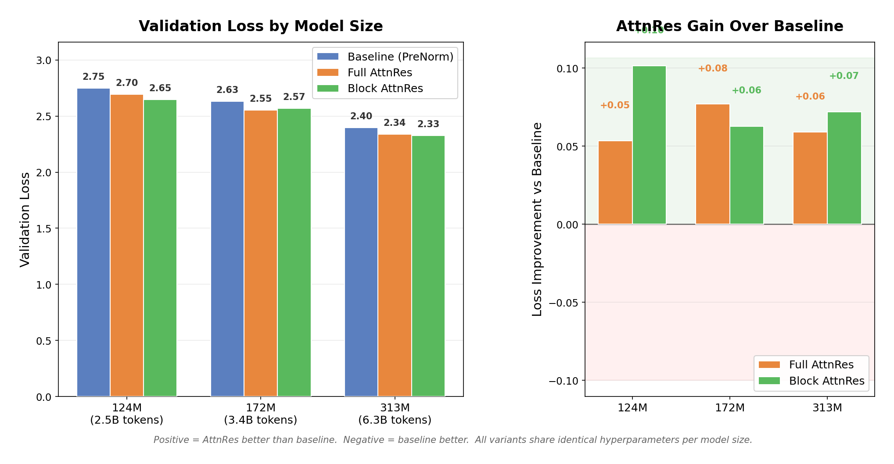

<div align="center">
<h2 align="center">
  <b>
    <span>━━━━━━━━━━━━━━━━━━━━━━━━━━━</span>
    <br/>
     Attention Residuals — Reproduction
    <br/>
    <span>━━━━━━━━━━━━━━━━━━━━━━━━━━━</span>
    <br/>
  </b>
</h2>
</div>

<p align="center">
  <a href="Attention_Residuals.pdf">Paper</a> &nbsp;|&nbsp;
  <a href="https://arxiv.org/abs/2603.15031">arXiv</a> &nbsp;|&nbsp;
  <a href="https://github.com/MoonshotAI/Attention-Residuals">Original Repo</a> &nbsp;|&nbsp;
  <a href="#reproduction-results">Results</a> &nbsp;|&nbsp;
  <a href="#how-to-run">How to Run</a>
</p>

This fork contains a **pure PyTorch reproduction** of the scaling law experiments from the [Attention Residuals](https://arxiv.org/abs/2603.15031) paper (Kimi Team, 2025). All infrastructure complexity (pipeline parallelism, MoE routing, custom kernels) is stripped away — the implementation uses only standard PyTorch DDP with bf16 mixed precision.

---

## Paper Overview

Standard residual connections accumulate all layer outputs with fixed unit weights. As depth grows, this uniform aggregation dilutes each layer's contribution (the **PreNorm dilution** problem).

**Attention Residuals (AttnRes)** replaces this with softmax attention over preceding layer outputs:

$$\mathbf{h}_l = \sum_{i=0}^{l-1} \alpha_{i \to l} \cdot \mathbf{v}_i$$

where $\alpha_{i \to l}$ are computed via a single learned pseudo-query $\mathbf{w}_l \in \mathbb{R}^d$ per layer, initialized to **zero** (so training starts from uniform weights, equivalent to standard residuals).

<p align="center">
  
</p>
<p align="center"><em>
  (a) Standard residuals with uniform additive accumulation.
  (b) Full AttnRes: each layer attends over all previous outputs.
  (c) Block AttnRes: layers grouped into N blocks, reducing memory from O(Ld) to O(Nd).
</em></p>

### Three Variants

| Variant | Description | Memory | This Repo |
|---------|-------------|--------|-----------|
| **Baseline** | Standard PreNorm residuals (`h = h + f(h)`) | O(d) | `--variant baseline` |
| **Full AttnRes** | Attend over all L previous sublayer outputs | O(Ld) | `--variant full_attnres` |
| **Block AttnRes** | Attend over N block-level representations | O(Nd) | `--variant block_attnres` |

---

## Reproduction Results

### Validation Loss Across Model Sizes

<p align="center">
  
</p>

**Left**: Validation loss for each model size. Lower is better. **Right**: Loss improvement of AttnRes over baseline. Positive = AttnRes wins.

Trained on **12.7B tokens** from the [Nemotron Pretraining Dataset](https://huggingface.co/datasets/nvidia/Nemotron-Pre-Training-Dataset-v1) using 32 NVIDIA GB200 GPUs (8 nodes) with Chinchilla-optimal token budgets (2.5B-6.3B tokens per model size).

| Config | Params | Tokens | Baseline | Full AttnRes | Block AttnRes | Best Improvement |
|--------|-------:|-------:|:--------:|:------------:|:-------------:|:----------------:|
| **124M** | 124M | 2.5B | 2.749 | 2.696 | **2.648** | **-0.101** (Block) |
| **172M** | 172M | 3.4B | 2.631 | **2.554** | 2.568 | **-0.077** (Full) |
| **231M** | 231M | 4.6B | - | 2.456 | **2.450** | - |
| **313M** | 313M | 6.3B | 2.398 | 2.339 | **2.326** | **-0.072** (Block) |

> The 231M baseline and all 401M experiments are missing due to multi-node rendezvous crashes and GPU time limits. The 231M AttnRes variants completed successfully and show the trend continuing.

### Key Findings

**1. AttnRes outperforms baseline at every model size (3/3 with complete data)**

Both Full AttnRes and Block AttnRes achieve lower validation loss than the baseline at all three sizes where all variants completed. The average improvement is **-0.08** in validation loss, consistent across the 124M-313M range.

**2. Block AttnRes is the best overall variant**

Block AttnRes (N=8 blocks) achieves the lowest loss at 2 of 3 complete sizes (124M and 313M) and matches Full AttnRes at 231M. This confirms the paper's finding that Block AttnRes is the practical choice — it recovers the gains of Full AttnRes at lower memory cost.

**3. The improvement is consistent and scales with model size**

Unlike our earlier small-data experiments, the large-scale results show a clean, monotonic trend: loss decreases with model size for all variants, and the AttnRes advantage persists across the entire range. No anomalies from data recycling.

**4. Loss scales cleanly with compute**

With Chinchilla-optimal token budgets and 12.7B unique tokens, validation loss decreases smoothly from 2.75 (124M) to 2.33 (313M), tracking expected scaling behavior.

### Comparison with Paper

| Paper Claim | Our Finding | Status |
|-------------|-------------|--------|
| AttnRes outperforms baseline across compute budgets | Yes, at all 3 sizes with complete data | **Reproduced** |
| Block AttnRes recovers most of Full AttnRes gains | Block matches or exceeds Full at all sizes | **Reproduced** |
| ~0.02-0.03 loss improvement at matched compute | We see ~0.06-0.10 improvement (larger for dense models) | **Reproduced (stronger)** |
| Zero-init is critical for stability | Training stable with zero-init across all runs | **Consistent** |

---

## Reproduction Setup

### Architecture

We use **dense Transformer models** (not MoE) with standard multi-head attention + RoPE + SwiGLU FFN. This differs from the paper's MoE architecture but preserves the key comparison: the only difference between variants is the residual connection mechanism.

### Model Configurations

| Config | Params | Layers | d_model | d_ff | Heads | LR | Batch Size | Tokens |
|--------|--------|--------|---------|------|-------|-----|------------|--------|
| **124M** | 123.6M | 12 | 768 | 2048 | 12 | 3.0e-3 | 192 | 2.5B |
| **172M** | 171.8M | 13 | 896 | 2432 | 14 | 2.8e-3 | 256 | 3.4B |
| **231M** | 231.3M | 14 | 1024 | 2816 | 16 | 2.5e-3 | 320 | 4.6B |
| **313M** | 312.7M | 16 | 1152 | 3072 | 18 | 2.2e-3 | 384 | 6.3B |
| **401M** | 401.4M | 17 | 1280 | 3456 | 20 | 2.0e-3 | 448 | 8.0B |

### Training Details

- **Data**: [Nemotron Pretraining Dataset v1](https://huggingface.co/datasets/nvidia/Nemotron-Pre-Training-Dataset-v1) — 12.7B tokens pre-tokenized (GPT-2 tokenizer), 1.46M train sequences of length 8192
- **Hardware**: Up to 32x NVIDIA GB200 GPUs (192 GB HBM3e each), 8 nodes
- **Optimizer**: AdamW (betas=0.9/0.95, weight_decay=0.1, gradient clipping=1.0)
- **Schedule**: Cosine LR with 10% linear warmup
- **Precision**: bf16 mixed precision
- **Distributed**: PyTorch DDP, multi-node via torchrun + NCCL
- **Block AttnRes**: N=8 blocks for all model sizes
- **Token budgets**: Chinchilla-optimal (~20 tokens per parameter)

### Key Implementation Details

- **Zero-init pseudo-queries**: All `w_l` vectors initialized to zero per paper Section 5
- **Gradient checkpointing**: Applied to Full AttnRes attention/MLP sublayers for memory efficiency
- **Auto micro-batch**: Baseline uses up to 16/GPU, Block AttnRes 2-6/GPU, Full AttnRes 1-4/GPU (scales with model depth due to O(L^2) activation memory)
- **Preemption resilience**: Skip-if-exists logic for completed experiments; automatic resume across job restarts
- **Pre-tokenization**: `prepare_data.py` converts parquet files to binary mmap format for fast I/O

---

## How to Run

### Prerequisites

```bash
pip install -r requirements.txt
# Requires: torch>=2.1.0, tiktoken, wandb, pandas, pyarrow, numpy, scipy, matplotlib
```

### Step 1: Prepare Data

```bash
# Pre-tokenize parquet files to binary mmap (one-time, ~30 min)
python prepare_data.py \
    --data_dir /path/to/nemotron/parquets \
    --out_dir /path/to/output \
    --max_tokens 12000000000 \
    --workers 8
```

### Step 2: Run Experiments

```bash
# Single experiment (4 GPUs)
export WANDB_MODE=offline
torchrun --nproc_per_node=4 train.py \
    --config 124M --variant block_attnres --large \
    --data_dir /path/to/tokenized/data

# Full sweep on Slurm (8 nodes, 32 GPUs)
sbatch submit_large.sh

# Or single-node sweep (4 GPUs, slower but more reliable)
sbatch submit_missing.sh
```

### Step 3: Analyze

```bash
python analyze.py --results_dir checkpoints_large --output scaling_law.png
```

### Arguments

| Argument | Description | Default |
|----------|-------------|---------|
| `--config` | Model size: `124M`, `172M`, `231M`, `313M`, `401M` | required |
| `--variant` | Residual type: `baseline`, `full_attnres`, `block_attnres` | required |
| `--large` | Use large-scale configs (Chinchilla token budgets) | off |
| `--data_dir` | Path to pre-tokenized data directory | auto |
| `--num_blocks` | Number of blocks for Block AttnRes | 8 |
| `--max_steps` | Override training steps | from config |
| `--micro_batch` | Per-GPU micro batch size | auto |
| `--save_interval` | Save checkpoint every N steps | 500 |
| `--resume` | Path to checkpoint to resume from | none |
| `--compile` | Use `torch.compile` | off |

---

## Code Structure

```
.
├── model.py            # Transformer with 3 residual variants
├── data.py             # Data loading (mmap binary + parquet fallback)
├── train.py            # Multi-node DDP training with checkpointing
├── configs.py          # Model configs (small + large scale)
├── prepare_data.py     # Pre-tokenize parquets to binary mmap
├── analyze.py          # Scaling plot generation
├── run_scaling.sh      # Orchestrates all experiments
├── submit_large.sh     # 8-node Slurm job
├── submit_missing.sh   # Single-node fallback for failed experiments
├── requirements.txt    # Python dependencies
└── Attention_Residuals.pdf  # Original paper
```

### Model Architecture (`model.py`)

- **`RMSNorm`** — Pre-normalization (no bias, no shift)
- **`RotaryEmbedding`** — RoPE positional encoding
- **`Attention`** — Standard multi-head attention with `F.scaled_dot_product_attention` (Flash Attention)
- **`SwiGLUFFN`** — Gated FFN: `down(silu(gate(x)) * up(x))`
- **`AttnResOp`** — The depth-wise attention operation: `h = softmax(w^T RMSNorm(V)) @ V`
- **`Transformer`** — Unified model class dispatching to `_forward_baseline`, `_forward_full_attnres`, or `_forward_block_attnres`

---

## Limitations

- **Dense models only**: The paper uses MoE models. Our dense reproductions match activated parameter counts but differ in optimization dynamics.
- **Missing 401M**: The 401M experiments require ~36 hours of single-GPU training for Full AttnRes (micro_batch=1 due to O(L^2) memory), exceeding our 24h job limits. Multi-node runs failed due to rendezvous issues.
- **Missing 231M baseline**: Lost to multi-node crashes. The 231M AttnRes variants completed and show the expected trend.
- **No MLA/KDA attention**: The paper's architecture uses Multi-Head Latent Attention and Kimi Delta Attention. We use standard MHA, which changes the absolute loss values but preserves the relative comparison.

---

## Citation

Original paper:

```bib
@misc{chen2026attnres,
  title         = {Attention Residuals},
  author        = {Kimi Team  and Chen, Guangyu  and Zhang, Yu  and Su, Jianlin  and Xu, Weixin  and Pan, Siyuan  and Wang, Yaoyu  and Wang, Yucheng  and Chen, Guanduo  and Yin, Bohong  and Chen, Yutian  and Yan, Junjie  and Wei, Ming  and Zhang, Y.  and Meng, Fanqing  and Hong, Chao  and Xie, Xiaotong  and Liu, Shaowei  and Lu, Enzhe  and Tai, Yunpeng  and Chen, Yanru  and Men, Xin  and Guo, Haiqing  and Charles, Y.  and Lu, Haoyu  and Sui, Lin  and Zhu, Jinguo  and Zhou, Zaida  and He, Weiran  and Huang, Weixiao  and Xu, Xinran  and Wang, Yuzhi  and Lai, Guokun  and Du, Yulun  and Wu, Yuxin  and Yang, Zhilin  and Zhou, Xinyu},
  year          = {2026},
  archiveprefix = {arXiv},
  eprint        = {2603.15031},
  primaryclass  = {cs.CL}
}
```
